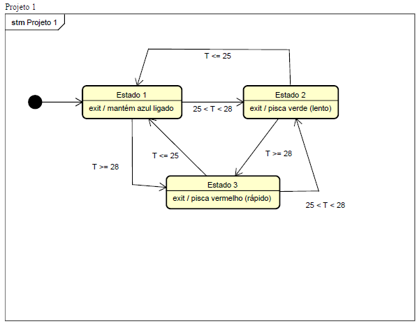

# Projeto: Monitoramento da Temperatura interna do RP2040 com Feedback Visual e OLED

## Autores

*   Bárbara Maria Barreto Fonseca de Cerqueira César - RA: 166242
*   Glauco César Prado Soares - RA: 205404

## Descrição

Este projeto consiste em um sistema de monitoramento de temperatura utilizando a Raspberry Pi Pico W e seus componentes. O sistema lê a temperatura interna do chip, aplica um filtro de suavização (EMA), converte a temperatura para Celsius, Fahrenheit e Kelvin, e exibe os dados em um display OLED. Além disso, utiliza LEDs RGB para indicar a faixa de temperatura, piscando com frequência proporcional à criticidade da temperatura.

Simplificadamente, o projeto consiste em um termômetro inteligente que não só mostra a temperatura em diferentes unidades, mas também muda de cor (azul, verde, vermelho) para indicar se está frio, normal ou quente, respectivamente. A frequência com que a luz pisca também indica a urgência da situação.

OBS: Foi observado que para diferentes versões da BitDogLab as cores do LED RGB estão conectadas em GPIOs diferentes: para versões mais antigas o azul está conectado no GPIO 13 e o vermelho no GPIO 12, para modelos mais recentes, os GPIOs estão trocados. Para ambas as versões o verde está conectado ao GPIO 11. O projeto foi desenvolvido utilizando uma versão mais recente da placa, ou seja, LED vermelho GPIO 13 e LED azul GPIO 12.

## Funcionalidades Principais

*   **Leitura da temperatura interna do chip:** Utiliza o sensor de temperatura interno do RP2040.
*   **Filtro de suavização (EMA):** Aplica um filtro para reduzir o ruído nas leituras do sensor.
*   **Conversão de unidades:** Converte a temperatura para Celsius, Fahrenheit e Kelvin.
*   **Exibição no display OLED:** Mostra as temperaturas nas três unidades de medida.
*   **Indicação visual com LEDs RGB:**
    *   Azul para temperatura baixa (≤ 25 °C)
    *   Verde para temperatura normal (25 °C – 28 °C)
    *   Vermelho para temperatura alta (> 28 °C)
*   **Piscar dos LEDs:** A frequência do piscar aumenta com a criticidade da temperatura.

## Componentes Utilizados

*   BitDogLab com Raspberry Pi Pico W e microcontrolador RP2040
*   Display OLED com controlador SSD1306 (comunicação I2C)
*   LEDs RGB conectados aos pinos (controlados por PWM)
*   Sensor de temperatura interno do RP2040 (canal ADC 4)

## Como Funciona

O sistema lê a temperatura do sensor interno do Raspberry Pi Pico W e a converte para as escalas Celsius, Fahrenheit e Kelvin. Um filtro de média móvel exponencial (EMA) é aplicado para suavizar as leituras e reduzir o ruído. As temperaturas são exibidas em um display OLED, e um LED RGB indica a faixa de temperatura:

*   **Azul:** Temperatura baixa (≤ 25 °C)
*   **Verde:** Temperatura normal (25 °C – 28 °C)
*   **Vermelho:** Temperatura alta (> 28 °C)

A frequência com que o LED pisca aumenta conforme a temperatura se torna mais crítica.

## Diagrama de Estados

O diagrama abaixo ilustra o fluxo de estados do sistema:

## Próximos Passos

Para futuros projetos, pretendemos utilizar a conexão Wi-Fi do módulo para exibir a temperatura em uma página HTML.

## Código

O código foi detalhadamente comentado para facilitar a compreensão.

## Mais Informações

Para mais informações, consulte a documentação completa do projeto.
