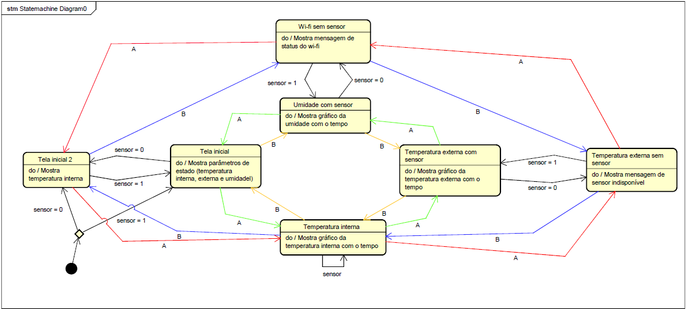

# Projeto: Monitoramento de Ambiente e Interface Web com Raspberry Pi Pico W

## Autores

*   Bárbara Maria Barreto Fonseca de Cerqueira César - RA: 166242
*   Glauco César Prado Soares - RA: 205404

## Descrição

Este projeto é uma expansão de um sistema de monitoramento de temperatura já existente, utilizando a placa BitDogLab acoplada à Raspberry Pi Pico W. O sistema original focava na leitura da temperatura interna do microcontrolador RP2040 e sua exibição em um display OLED, além de controlar um LED RGB conforme a faixa de temperatura.

A nova versão mantém e aprimora essas funcionalidades, incorporando a leitura de temperatura e umidade externas através do sensor DHT22. Os dados são exibidos no display OLED, que agora permite a alternância entre diferentes telas (dados básicos, históricos de temperatura interna/externa e umidade) por meio dos botões A e B.

Além disso, uma das principais inovação é a integração da conectividade Wi-Fi da Pico W. Isso possibilitou a criação de um servidor HTTP que disponibiliza em tempo real os dados de temperatura (interna e externa) e umidade em uma interface web acessível via navegador em qualquer dispositivo conectado à mesma rede. O projeto utiliza a linguagem C e o SDK oficial da Raspberry Pi, com o processamento de rede sendo executado no Core 1 do RP2040 para otimizar o desempenho.

Simplificadamente, este é um sistema de monitoramento ambiental inteligente que não só exibe dados em um display local e muda de cor conforme a temperatura, mas também permite a navegação entre diferentes visualizações e o acesso remoto aos dados via uma página web.

**OBS:** Foi observado que para diferentes versões da BitDogLab as cores do LED RGB estão conectadas em GPIOs diferentes: para versões mais antigas o azul está conectado no GPIO 13 e o vermelho no GPIO 12, para modelos mais recentes, os GPIOs estão trocados. Para ambas as versões o verde está conectado ao GPIO 11. O projeto foi desenvolvido utilizando uma versão mais recente da placa, ou seja, LED vermelho GPIO 13 e LED azul GPIO 12.

## Funcionalidades Principais

*   **Leitura da temperatura interna do chip:** Utiliza o sensor de temperatura interno do RP2040 (canal ADC 4).
*   **Leitura de temperatura e umidade externas:** Realizada pelo sensor DHT22, conectado ao GPIO 20.
*   **Filtro de suavização (EMA):** Aplicação de Exponential Moving Average para suavizar as leituras dos sensores e reduzir ruídos.
*   **Exibição no display OLED (SSD1306):**
    *   Exibe temperatura interna, externa e umidade.
    *   Permite alternância entre 4 telas via botões A e B:
        1.  Dados básicos (temperaturas e umidade atuais).
        2.  Histórico da temperatura interna (gráfico de barras).
        3.  Histórico da temperatura externa (gráfico de barras, com mensagem de sensor indisponível).
        4.  Histórico da umidade (gráfico de barras) ou informações da conexão Wi-Fi (caso o sensor DHT22 esteja desconectado).
*   **Indicação visual com LED RGB:**
    *   **Azul:** Temperatura ≤ 25°C (permanece fixo).
    *   **Verde:** Temperatura entre 25°C e 28°C (pisca).
    *   **Vermelho:** Temperatura > 28°C (pisca).
    *   A frequência de piscar do LED verde ou vermelho indica o status.
*   **Servidor HTTP via Wi-Fi:**
    *   Conexão automática à rede Wi-Fi configurada.
    *   Criação de um servidor HTTP na porta 80.
    *   Página web com atualização automática a cada 2 segundos, exibindo:
        *   Temperatura interna e externa (em °C, °F, K).
        *   Umidade relativa do ar (%).
    *   Permite monitoramento remoto e contínuo via navegador web.
*   **Multicore Processing:** Utiliza o Core 1 do RP2040 para gerenciar as tarefas de conectividade Wi-Fi e o servidor HTTP, enquanto o Core 0 cuida das leituras dos sensores e da interface física, garantindo paralelismo real.
*   **Tratamento de Erros do DHT22:** Implementa tratamento para `DHT_RESULT_TIMEOUT` (fiação incorreta, sensor danificado, falta de pull-up) e `DHT_RESULT_BAD_CHECKSUM` (ruído elétrico, alimentação instável), exibindo "---" no OLED e mensagens de debug no console.

## Ferramentas e Tecnologias

*   **Linguagem:** C
*   **Ambiente de Desenvolvimento:** VS Code
*   **SDK:** Raspberry Pi Pico C/C++ SDK
*   **Bibliotecas Utilizadas:**
    *   `hardware/adc.h` — Para leitura da temperatura interna do RP2040.
    *   `hardware/pwm.h` — Para controle do LED RGB.
    *   `hardware/i2c.h` — Para comunicação com o display OLED.
    *   `ssd1306.h` — Para controle específico do display OLED.
    *   `dht.h` — Para comunicação com o sensor DHT22.
    *   `cyw43_arch.h` e `lwip/tcp.h` — Para configuração da conectividade Wi-Fi e implementação do servidor HTTP.

## Componentes Utilizados

*   Placa BitDogLab com Raspberry Pi Pico W e microcontrolador RP2040.
*   Display OLED com controlador SSD1306 (comunicação I2C nos pinos GP14 e GP15).
*   Botões A (GPIO 5) e B (GPIO 6) para navegação no display.
*   LED RGB (pinos GPIO 13, 11, 12, controlados por PWM).
*   Sensor de temperatura interno do RP2040 (canal ADC 4).
*   Módulo Wi-Fi CYW43 integrado na Pico W.
*   Sensor de temperatura e umidade DHT22 (conectado ao GPIO 20).

## Como Funciona

O sistema opera em um fluxo contínuo de monitoramento e exibição de dados:

1.  **Inicialização:** Todos os periféricos (ADC, I2C, PWM, Botões, Sensor DHT22) são inicializados.
2.  **Conectividade Wi-Fi:** A conexão Wi-Fi é estabelecida em paralelo, sendo gerenciada pelo Core 1 do RP2040. O servidor HTTP é iniciado na porta 80, aguardando requisições.
3.  **Leituras Periódicas:**
    *   A temperatura interna do RP2040 é lida a cada 1 segundo.
    *   O sensor DHT22 é lido a cada 2 segundos para obter temperatura e umidade externas.
    *   Um filtro EMA é aplicado para suavizar todas as leituras.
4.  **Controle Visual e Exibição Local:**
    *   O LED RGB é atualizado com base na temperatura interna: azul (≤ 25°C), verde (25-28°C) ou vermelho (> 28°C). O LED verde ou vermelho pisca, enquanto o azul permanece fixo.
    *   O display OLED é atualizado para mostrar os dados. Os botões A e B permitem ao usuário alternar entre as 4 telas de visualização (dados básicos, histórico de temperatura interna, histórico de temperatura externa, histórico de umidade/informações Wi-Fi). Em caso de falha do DHT22, o display mostra "---" para os valores externos e uma mensagem de sensor indisponível ou informações da rede Wi-Fi.
5.  **Disponibilização de Dados Web:** Os valores de temperatura interna, externa e umidade são disponibilizados em tempo real através da página web hospedada pelo servidor HTTP. A página se auto-atualiza a cada 2 segundos, permitindo o monitoramento remoto.

## Diagrama de Estados

O diagrama abaixo ilustra o fluxo de alternância de telas no display OLED, controlado pelos botões A e B:

## Código

O código foi detalhadamente comentado para facilitar a compreensão e a manutenção.

## Mais Informações

Para mais informações detalhadas sobre o projeto, incluindo a implementação de cada funcionalidade e os princípios técnicos, consulte a [documentação completa do projeto.](https://docs.google.com/document/d/1r-2Qm-_kHL7yd0ubupmXyRhmOGEIDyQKk6v31nm39Eg/edit?tab=t.0)
